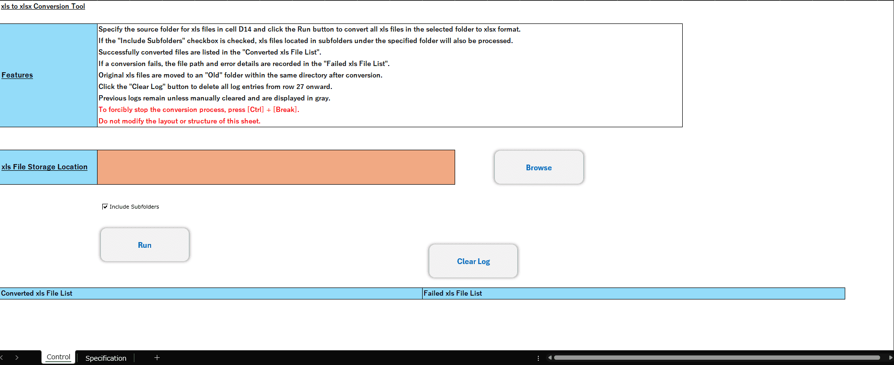

# 📄 Batch xls to xlsx Converter

## Overview

This tool converts legacy Excel files (.xls) to the modern .xlsx format in bulk.

It allows users to specify a target folder and optionally include subfolders.  
Converted files are logged, and any errors during conversion are recorded for review.

This tool was developed using VBA (Excel Macro) for business process automation.

---

## 📸 Screenshots

### Home Screen


---

## ✨ Features

- Batch conversion from **.xls → .xlsx**
- Optional **subfolder inclusion**
- Automatic creation of an **Old** folder to store original files
- Conversion result logging
- Error logging with detailed messages
- Log reset function
- Safe termination support (Ctrl + Break)

---

## 📥 Input

| Item | Description |
|------|------------|
| Target Folder (Cell D14) | Folder containing .xls files |
| Include Subfolders | Checkbox option to process subdirectories |

---

## ⚙️ Process Flow

1. Select target folder  
2. Scan for .xls files  
3. Convert each file to .xlsx  
4. Move original .xls files to the **Old** folder  
5. Log success or failure  

---

## 📤 Output

- **Converted xls File List**
- **Failed xls File List** (with error details)

Logs remain unless manually cleared.  
Older logs are displayed in gray.

---

## 🛑 Error Handling

- Skips files currently open
- Captures and records error details
- Ensures file handles are properly closed
- Allows forced termination using:

```

Ctrl + Break

```

---

## 🧱 System Requirements

- Microsoft Excel (Macro-enabled)
- VBA enabled
- Windows environment recommended

---

## 📁 File Structure

```

Project
│
├── xls_to_xlsx_converter.xlsm
└── README.md

```

---

## 🚀 Use Case

Designed for environments where legacy Excel formats (.xls) must be upgraded to .xlsx for:

- Compatibility
- File size optimization
- Modern Excel feature support
- Standardization across teams

---

## 🛠 Technologies Used

- VBA
- Excel FileSystem handling
- File locking detection
- Structured error logging
